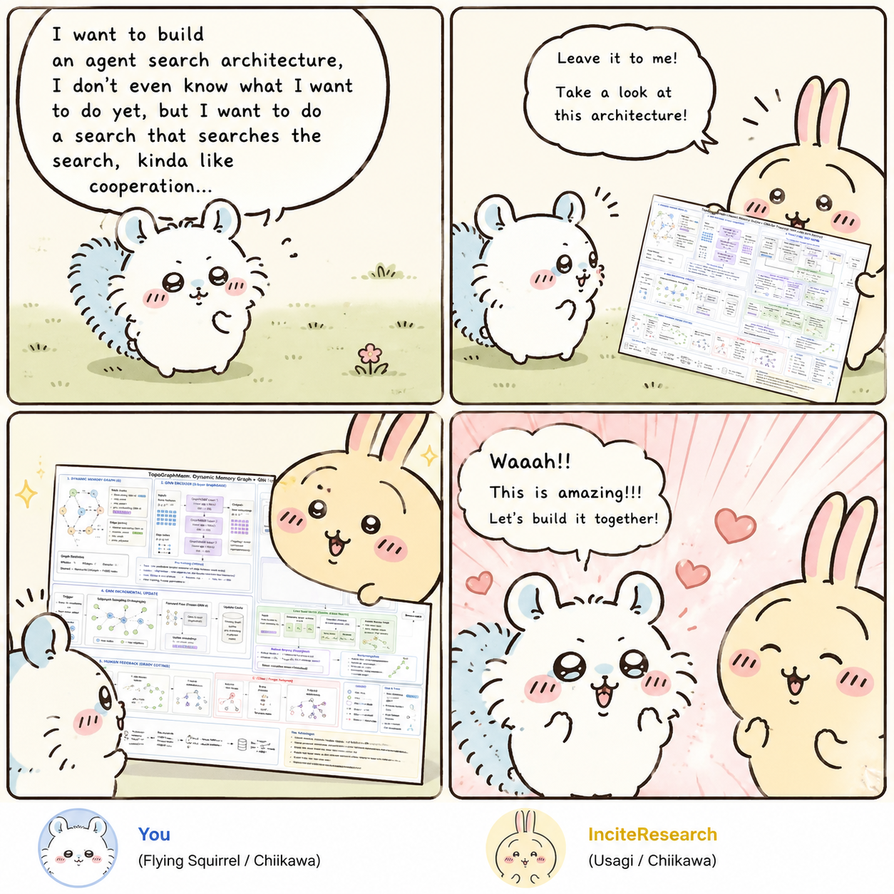
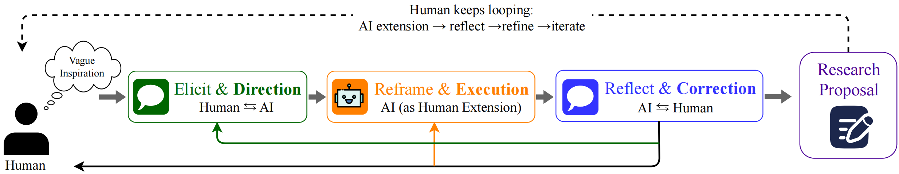

<div align="center"> 

# InciteResearch

**The missing first step in AI-assisted research**

Turn a vague frustration into a breakable assumption, a falsifiable story arc, and a **concrete, method-level proposal**.

[](https://www.python.org/downloads/) [](https://arxiv.org/abs/2605.06345) [](LICENSE)

[Quick Start](#quick-start)

English | [简体中文](README_zh.md)

</div>

---

<div align="center">
  <div style="position:relative;display:inline-block;width:min(820px,100%);margin:auto;">
    
  </div>
</div>

Every existing AI research tool starts from an already crisp **task**: a title, a benchmark, or a training recipe. Most real research starts earlier: a method that feels wrong, a shaky assumption in a paper, a metric you distrust. InciteResearch works **before** you have that crisp task. It compresses a fuzzy itch into an **executable method narrative** (what to build, what to compare, what would falsify the idea) — specific enough for the tools above to take over.

> 📄 **Paper:** [More Than Can Be Said: A Benchmark and Framework for Pre-Question Scientific Ideation](https://arxiv.org/abs/2605.06345) — Jie Yu, Song Qiu (arXiv:2605.06345 [cs.AI])

## Key Features

---

- Friction-first elicitation — starts from what bothers you, not from a finished research question
- Assumption Breaking over Gap Analysis — yields directions that attack a field's hidden premises instead of bolting a module onto a baseline
- Story arc validation — the **method** must be the logically necessary consequence of the insight, not one of many plausible add-ons
- **Structured artifacts** — chiefly `research_proposal.md` and related session state; **`--refine-method`** extends the same thread into a long, checkable **PLAN** grounded in literature

## A New Paradigm

---

<div align="center">  </div>

Most AI research tools position themselves as autonomous systems: given enough scaffolding, the model should be able to generate a paper end-to-end. InciteResearch is built on a different conviction. As illustrated above, the process begins with casual human conversation — the researcher steers the direction while AI broadens the thought space through assumption-breaking. The human then reflects and corrects; AI provides its own directional suggestions. This loop continues until the vague inspiration becomes an explicit, structured research proposal.

This is not a pipeline with a human in the loop. It is a cognitive collaboration where the human's tacit sense of "something is off" is the irreplaceable input, and the AI's role is to extend that intuition — giving it leverage, articulation, and reach — rather than to replace it.

Three operators make this concrete:

- **E (Elicitation)** — surfaces implicit friction into a structured profile (friction point, motivation, constraints, taste, and a **working method angle**). The friction anchors everything else.
- **V (Validity & Reframing)** — instead of finding gaps in the literature, identifies the hidden assumption that, if broken, maximizes the product of feasibility and novelty. The output is not an incremental rewrite of the original direction but a re-anchoring under a new conceptual coordinate system.
- **N (Necessity Checking)** — acts as a strict reviewer. The proposed method must be the logically necessary consequence of the insight, not merely one of several plausible options. Any component that cannot be derived from the causal chain is rejected.

This paradigm — **Elicit → Violate → Necessitate** — is not an arbitrary modularization of Socratic questioning. Ablation results show that removing V causes the sharpest drop across all metrics (novelty 4.250 → 3.500, impact 4.397 → 3.720), confirming that assumption violation carries structural weight, not merely stylistic variety. Removing E causes the second-largest drop in novelty and is the only ablation where feasibility _increases_, revealing that the E stage is responsible for anchoring generation on real friction rather than surface-level reformulation.

## Quick Start

---

### Install

```bash
git clone https://github.com/Paradoxtcal/InciteResearch
cd InciteResearch
pip install -r requirements.txt

cp .env.example .env
```

Edit `.env` with at least one provider and matching `*_MODEL` where needed (see `.env.example`).

### Main CLI (vague idea → structured proposal)

```bash
python main.py
```

> **Tip — already have a direction?** At the first *research direction* prompt, enter your confusion in full (paragraphs are fine). For later numbered multiple-choice prompts, type **`1`** and press Enter each time to take the first option and move on quickly.

The session opens with a single prompt. Answer in plain language — there is no form, and any language is fine.

Resume a saved session:

```bash
python main.py --resume <session_id_from_research_state>
```

### Method refinement lab (`--refine-method`)

**Typical path:** run `python main.py` first when you want `research_proposal.md` in the repo root, then:

```bash
python main.py --refine-method
```

## Scope of Application

---

**Applicable:** Empirical research involving code implementation, including: CS (CV / NLP / ML / Systems), Computational Biology, Data Science, and Computational Physics/Chemistry.

**Inapplicable:** Pure mathematical proofs, hermeneutics in the humanities and social sciences, and clinical trials requiring ethical review.

## Contributing

---

The one constraint: don't turn this into a form-filling pipeline. The core of the design lies in how AI gives wings to human thinking. The value is in discovering the research question through dialogue. Any change that skips or shortcuts elicitation defeats the purpose.

Most welcome: real usage cases, new Socratic trigger archetypes, domain-specific prompt improvements, evaluation methodology for idea quality.

## License

---

MIT