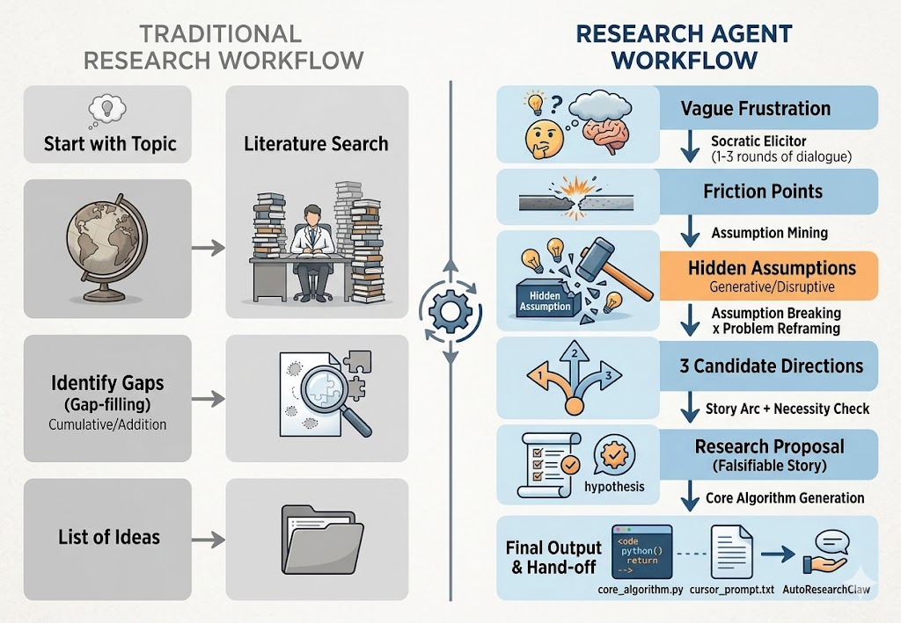

<div align="center">
  

  # InciteResearch

  **AI 辅助科研中缺失的第一步**

  将研究者模糊的痛点，转化为可打破的假设、可证伪的故事主线，以及可直接交给 Cursor 或 Claude Code 的带注释核心算法代码。

  [](https://www.python.org/downloads/) [](https://github.com/langchain-ai/langgraph) [](LICENSE)

  [快速开始](#快速开始) · [工作原理](#工作原理) · [路线图](#路线图)

  [English](README.md) | 简体中文

</div>

---

现有的所有 AI 科研工具都从一个明确的课题出发。[AutoResearchClaw](https://github.com/aiming-lab/AutoResearchClaw) 将研究方向转化为完整的论文流水线；[karpathy/autoresearch](https://github.com/karpathy/autoresearch) 给定训练脚本后自主运行通宵实验循环；[DeepInnovator](https://github.com/HKUDS/DeepInnovator) 从文献分布中生成假设。它们都假设你已经知道自己要研究什么。

而真实的科研往往从更混乱的地方开始：一个感觉不对劲的方法、一篇假设似乎站不住脚的论文、一个你从未信任过的评估指标。InciteResearch 正是在这个时刻介入——在课题还不清晰之前——并产出足够具体的成果，供下游工具接力处理。

## 工作原理

---

<div align="center">
  
</div>

**苏格拉底式引导器**通过四种问题原型来挖掘隐性知识：

- **批判触发** — "最近哪篇论文让你觉得有什么地方不对劲？"
- **痛点触发** — "作为审稿人，你最想拒掉哪类投稿？"
- **愿景触发** — "三年后这个领域最有意义的论文会是什么样的？"
- **约束触发** — "你的算力预算和时间线是怎样的？"（备选）

**必要性检验**在方法被纳入故事主线之前，强制执行三项测试：

1. 是否存在更简单的替代方案？若有，为什么它还不够？
2. 故事中每个组件是否都有明确的"因为 X，所以必须有 Y"的逻辑？
3. 扩展基线规模能否达到相同效果？

任何未通过测试的方法都将被退回修改，直到通过才进入提案撰写阶段。

## 核心特性

---

- 摩擦优先的引导 — 从困扰你的问题出发，而非你已经决定好的方向
- 打破假设而非填补空白 — 产出挑战领域前提的方向，而非在现有方法上叠加模块
- 故事主线验证 — 方法必须是洞察的逻辑必然结果，而非仅仅是一个合理选项
- AI 助手就绪的代码输出 — `core_algorithm.py` 专为另一个 AI 阅读而写，每一行非平凡代码都带有 `# WHY` 和 `# DIFF` 注释
- 直接集成到 IDE — `cursor_prompt.txt` 是一个可直接粘贴的指令，用于将核心代码集成到选定的基线中
- 批量文献 PDF 压缩 — 压缩并打包数十个 PDF 用于 ChatGPT 文件上传，无需 API key
- 会话断点续传 — 任意节点均可暂停，使用 `--resume SESSION_ID` 恢复

## 网页界面（可选）

```bash
pip install streamlit

streamlit run app.py
```

## 快速开始

---

```bash
git clone https://github.com/Paradoxtcal/InciteResearch
cd InciteResearch
pip install -r requirements.txt

cp .env.example .env # 在 .env 中填入你的 API_KEY

python main.py
```

会话以单个问题开始。自然地回答即可——无需填写任何表单，支持任意语言。

```
==========================================================
  InciteResearch
  Your Phase-0 AI research partner: turn vague instincts into core algorithms
==========================================================

Let's start with what you're trying to do. It doesn't need to be clear yet.

What research direction are you thinking about?
> Hyperspectral single object tracking

AI: Got it — hyperspectral single object tracking. My first question is: since many RGB single-object trackers already handle complex backgrounds and target appearance changes pretty well, if we simply feed hyperspectral data into an existing RGB tracking framework via basic preprocessing (e.g., PCA dimensionality reduction, or stacking multiple bands as deeper channels), what fundamental bottlenecks would we hit? In other words, what is the kind of problem that you believe can only be properly solved in the hyperspectral domain?

You: I hadn't really thought about doing dimensionality reduction and then using an RGB tracker. My intuition is more that jointly handling spectral, spatial, and temporal dimensions in current hyperspectral trackers introduces a lot of issues. It seems necessary to consider them separately or design a new fusion strategy. An extreme case is what you said: not using spectral information at all.

AI: You mentioned that jointly considering spectral, spatial, and temporal dimensions causes many problems. Concretely, what is the most painful issue for you? Is it poor generalization, excessive compute/resource cost, or lack of robustness in real applications?

✓ Researcher profile built | friction points: 0

You: Hyperspectral data usually has at least dozens of bands. Each wavelength can behave differently even for the same material — let alone different materials. And during tracking, the target's appearance may change and the material properties may effectively change too. The possibility space feels huge. Can the model really converge?

✓ Researcher profile built | friction points: 5

Searching papers + mining assumptions...

[WARNING] Semantic Scholar search failed: 429 {"message": "Too Many Requests. Please wait and try again or apply for a key for higher rate limits. https://www.semanticscholar.org/product/api#api-key-form", "code": "429"}

✓ Papers: 57 | generated 3 candidate directions

--------------------------------------------------

Found 3 candidate directions (each breaks a different assumption):

1. Invariant Spectral Representation Learning under Dynamic Environmental Shifts
   Broken assumption: Spectral Feature Stability & Uniqueness (SFSU)
   One-liner: Develop a theoretical framework and model that explicitly models spectral instability rather than assuming uniqueness, learning spectral representations invariant to dynamic environment and material shifts for robust hyperspectral object tracking.

2. Intrinsic-Dimension-Aware Modeling with Sparsity Constraints for High-Dimensional Data
   Broken assumption: Complex Model High-Dim Data Processing (CMHDP)
   One-liner: Build a theory-driven, sparsity-constrained hyperspectral tracking model that explicitly extracts intrinsic low-dimensional manifold structure from high-dimensional observations, overcoming the curse of dimensionality while ensuring convergence and robustness.

3. Spectral-Native Self-Supervised Learning: Breaking Dependence on RGB Transfer
   Broken assumption: RGB Domain Knowledge Transferability (RGBDKT)
   One-liner: Develop a self-supervised learning framework tailored for hyperspectral data to learn robust, spectral-aware representations directly from spectral measurements, mitigating limitations of RGB-domain transfer and improving tracking performance.

Which direction do you pick? (1/2/3, or describe your own idea)
> 1

--------------------------------------------------

Candidate papers (title/abstract). Full text is skipped by default; pick only if needed:

 1. [2025] MSITrack: A Challenging Benchmark for Multispectral Single Object Tracking (semantic_scholar)
 2. [2025] Hyperspectral Object Tracking With Dual-Stream Prompt (semantic_scholar)
 3. [2024] Incorporating Prompt Learning and Adaptive Dropping Hyperspectral Information Tracker for Hyperspectral Object Tracking (semantic_scholar)
 4. [2025] A Multi-Stream Visual-Spectral-Spatial Adaptive Hyperspectral Object Tracking (semantic_scholar)
 5. [2023] RawTrack: Toward Single Object Tracking on Mosaic Hyperspectral Raw Data (semantic_scholar)
 6. [2026] HyperTrack: A Unified Network for Hyperspectral Video Object Tracking (semantic_scholar)
 7. [2025] Hyperspectral Video Tracking With Spectral–Spatial Fusion and Memory Enhancement (semantic_scholar)
 8. [2023] Learning a Deep Ensemble Network With Band Importance for Hyperspectral Object Tracking (semantic_scholar)
 9. [2024] Domain Adaptation-Aware Transformer for Hyperspectral Object Tracking (semantic_scholar)
10. [2023] DSP-Net: A Dynamic Spectral–Spatial Joint Perception Network for Hyperspectral Target Tracking (semantic_scholar)

Which papers should we read full text for (PDF only)? e.g., 1,3 / all / Enter to skip
>

✓ Selected direction: Invariant Spectral Representation Learning under Dynamic Environmental Shifts

Building the story arc...

✓ Mined 4 implicit assumptions | Novelty: 90% | Feasibility: 70%
✓ Story-arc closure checks passed
✓ Research proposal draft generated (11112 chars)

You: ok

--------------------------------------------------

A research proposal draft is ready.

OK. As an experiment design expert, I will translate your story arc into a detailed and executable research proposal draft. This proposal will strictly follow your core principles, highlight the essential algorithmic differences, choose appropriate baselines, design corresponding ablations, and include key risk analysis.

---

## Environment-Invariant Representation Learning for Hyperspectral Object Tracking: Treat Instability as Signal

### 1. Method Overview

Existing hyperspectral object tracking methods often rely on the Spectral Feature Stability & Uniqueness (SFSU) assumption. When dynamic environmental factors such as illumination, atmosphere, and target material state change drastically, robustness and generalization are fundamentally limited. Our key insight is: rather than treating spectral instability as "noise" to be filtered, we treat it as "signal" that reflects target–environment interaction, and explicitly model this dynamics. This forces us to design a framework that disentangles observed hyperspectral features into (i) an intrinsic, environment-invariant target representation (Z_target) and (ii) an environment-induced, dynamically changing representation (Z_env). By constructing an environment–spectrum causal model to understand how environment modulates spectra, combined with a disentangled representation learning architecture, auxiliary multimodal calibration, and adversarial adaptation, we aim to learn features invariant to environmental shifts for more robust and generalizable tracking.

### 2. Core Algorithm

Our core algorithm explicitly models the causal relationship between environment and spectrum and enforces learning disentangled, environment-invariant representations. The key difference from prior work is that instead of filtering environmental effects as noise, we actively exploit environmental variation as information to guide representation learning.

Pseudo-code: Environment-Invariant Hyperspectral Tracker (EI-HST)

```python
Input:
  H_t: hyperspectral cube at time t (W x H x B; B=bands)
  X_aux_t: auxiliary environmental/spatial data at time t (e.g., RGB, ...)
...
```

```

### 仅 PDF 压缩（无需 API key）

```bash
python main.py --compress-pdfs --pdf-dir ./papers
# 输出 papers_compressed.zip，可直接上传至 ChatGPT
```

## 输出格式

---

`core_algorithm.py` 不是可直接运行的项目，而是为 AI 编程助手准备的结构化规范。

`cursor_prompt.txt` 是一个可直接粘贴的指令块：

```
I have a baseline implementation of [nnUNet / MMDetection / …] from [repo].
I need to modify it to implement [core idea].
The key change is in [file] → [function].
Please apply the following and keep everything else unchanged:
[core algorithm block]
```

## 与其他工具的关系

---

InciteResearch 覆盖第 0–2 阶段，有意不重新实现其他工具已经做得很好的部分。

| 工具 | 功能 | 关系 |
| --- | --- | --- |
| InciteResearch | 痛点 → 假设 → 故事主线 → 核心代码 | 当前位置 |
| [AutoResearchClaw](https://github.com/aiming-lab/AutoResearchClaw) | 方向 → 完整论文流水线 | 下游 — 我们的输出是其输入 |
| [karpathy/autoresearch](https://github.com/karpathy/autoresearch) | 训练脚本 → 自主实验循环 | 下游 — 以 `core_algorithm.py` 为输入 |
| [DeepInnovator](https://github.com/HKUDS/DeepInnovator) | 文献 → 通过强化学习模型生成假设 | 互补 — 优化群体新颖性；我们优化研究者契合度 |
| [GPT-Researcher](https://github.com/assafelovic/gpt-researcher) | 查询 → 文献综合 | 上游 — 可替换第 1 阶段的文献检索 |

## 适用范围

---

**适用：** 涉及代码实现的实证研究，包括：计算机科学（CV / NLP / ML / 系统）、计算生物学、数据科学、计算物理/化学。

**不适用：** 纯数学证明、人文社科中的诠释学研究，以及需要伦理审查的临床试验。

## 路线图

---

**v0.2**
- 本地模型支持（DeepSeek-R1、Qwen2.5），用于隐私敏感研究
- 评估基准 — 衡量想法执行率（进入实际实验的方向比例）
- 实现决策助手 — 给定核心算法后，推荐具体实现选择：主干网络选择、损失函数、优化器、关键超参范围，以及所有细微但不直观的组件（如特定位置用 LayerNorm 还是 BatchNorm、热身调度、数据增强策略），每项均附一句与故事主线挂钩的理由

## 贡献指南

---

唯一约束：不要将其变成一个填表流水线。设计的核心在于 AI 如何为人类思维插上翅膀。价值在于通过对话发现研究问题。任何跳过或简化引导过程的改动都违背了初衷。

最欢迎：真实使用案例、新的苏格拉底式触发原型、特定领域的提示词优化、想法质量的评估方法论。

## License

---

MIT
